# Model Predictive Control
Real-Time Model Predictive Control simulations: MPC, MPC with constraints, DMC and GPC

## Model predictive control (MPC)
### Algorithm

* Initialization of the variables
* Get the augmented incremental model and the parameters of the control trajectories vector (DeltaU) based on the state-space system, the control horizon (Nc) and prediction horizon (Np) 
  * Augmented incremental model
  
	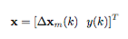
	
	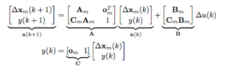
	
	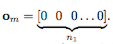

  * Incremental control trajectory vector (DeltaU) obtained from the cost function minimization
  
  	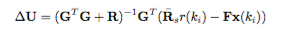	
	
	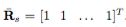 
	
	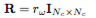
	
	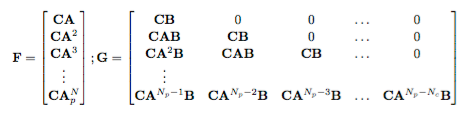
	
* Calculate the constant part of DeltaU

* Control loop

	* Read input signal 
	* Calculate the variable part of DeltaU
	* Add both parts and apply the receding horizon control extracting first element
	* Get the control signal
	
		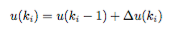
		
	* Get the incremental system state
	
		
		
### Example: Position control of a DC motor

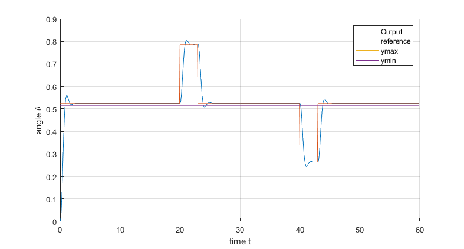

## MPC with output constraints

* In the initialization variables: 

	* Create M matrix
	
* In the control loop: 

	* Calculate the gamma matrix with the constraints of the output	
	* Recalculate DeltaU from optimization with restrictions
	
	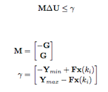

### Example: Position control of a DC motor with output constraints

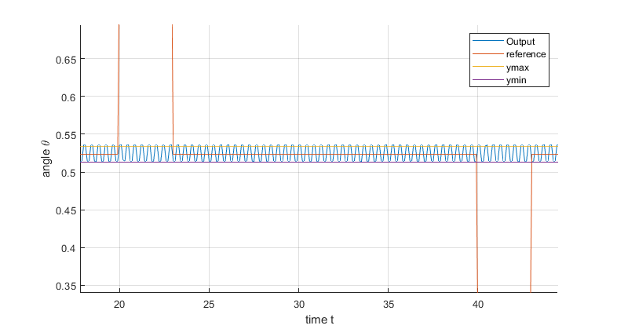

## Dynamic matrix control (DMC)

(under construction)

## Generalized predictive control (GPC)

(under construction)

## References
Theory and references from "Sistemas de control en tiempo real para aplicaciones industriales. Teoría, problemas y prácticas - Ramón Guzmán". Laboratory exercices developed in "Real-time control system" subject of Master’s degree in Automatic Systems Engineering and Industrial Electronics - UPC
