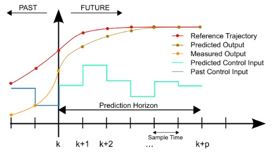
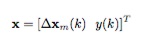
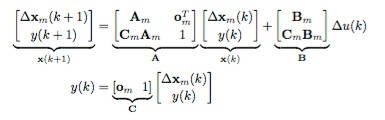
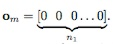
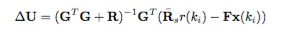
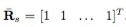
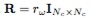
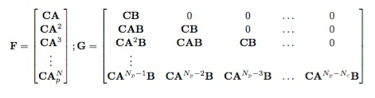
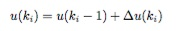
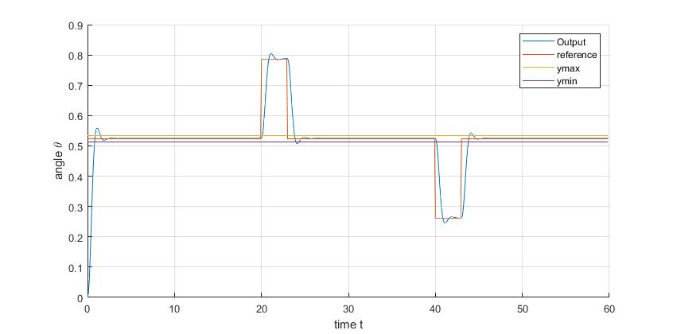

# Model Predictive Control
Real-Time Model Predictive Control simulations: MPC, MPC with constraints, DMC and GPC

## MPC
### Algorithm

* Initialization of the variables
* Get the augmented incremental model and the parameters of the control trajectories vector (DeltaU) based on the state-space system, the control horizon (Nc) and prediction horizon (Np) 
  * Augmented incremental model
  
	
	
	
	
	

  * Incremental control trajectory vector (DeltaU)
  
  	
	
	 
	
	
	
	
	
* Calculate the constant part of DeltaU

* Control loop

	* Read input signal 
	* Calculate the variable part of DeltaU
	* Add both parts and apply the receding horizon control extracting first element
	* Get the control signal
	
		
		
	* Get the incremental system state
	
		
		
### Example: Position control of a DC motor

## MPC with constraints
